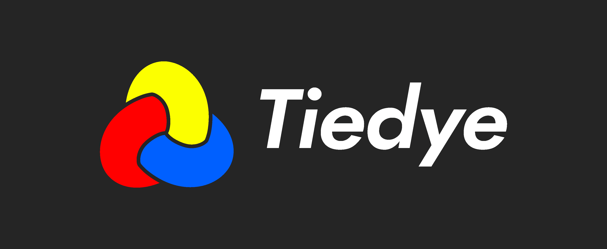

# Tiedye

Tiedye is a next generation financial engine. Built on top of the innovative new primitive of synthetic channels,
it allows a base layer blockchain to scale to very rapid trades on any imaginable asset or financial contract. It is 
built on the [Substrate](https://github.com/paritytech/substrate) blockchain framework.

## Use Cases

Tiedye can be used for the creation of any financial contract imaginable, granted there is a counter-party prepared
to take the other side. Since there are incentives and strategies to hedge trades, market makers will be able to make
profit by accepting many connections with little risk to their underlying collateral. Trading happens entirely offchain
inside of a special kind of state channel known as synthetic channels, that allow rapid updates.

Tiedye is agnostic to the kind of financial agreements that exist on the second layer network, some products that can
be built on top of the base Tiedye blockchain include:

- Margin trading. TieDEX could offer leveraged positions on _any_ asset, cryptoasset or 
traditional, with very little-- possibly no-- overhead to the counterparty.

- Prediction markets. Excerpt of the Rainbow Network paper: "Prediction market shares are particularly well-suited for 
Rainbow channels, because their prices have a fixed upper bound, which means it is possible to fully collateralize
positions in those shares. In fact, trading prediction market shares in Rainbow channels only requires the same amount
of collateralization as is required to trade those shares on-chain."

- Fiat currencies, exotic derivatives, complex financial contracts. The Tiedye settlement layer is completely agnostic
to the kinds of assets that are traded inside of its synthetic channels. They could be fiat currencies like the euro,
oil futures, or leveraged exposure with interest. As long as there's an accepted price oracle, it can be traded.

## Scalability

Tiedye is channel framework built on a specialized blockchain settlement layer, which means it will be intensely scalable.

## Modules

- [Channels](./runtime/src/channel.rs) - Allows for the creation of synthetic channels, a second-layer construct that
allows two-parties to make trades with each other at low-latency. 
- [Oracles](./runtime/src/oracle.rs) - Using the Substrate offchain worker, the Oracle module enables external data
such as price feeds to be brought onto the Tiedye chain. 
- [Disputes]() - Inspired by the Substrate Offences module, handles the disputes of channels and oracles.
